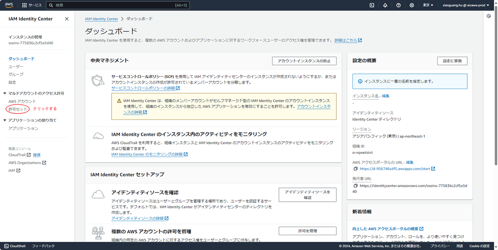

| IAM Identity Center設定手順                                                                                                  |
|--------------------------------------------------------------------------------------------------------------------------|
| 一．IAM Identity Centerの配置を有効化する                                                                                           |
| １．IAM Identity Centerにアクセスし、有効しているIAM Identity Centerの配置がないなら「有効にする」をクリックする                                              |

| 二．許可セットを作成する                                                                                                             |
| ２．他のアカウントからのアクセス許可を作成するために、「マルチアカウント」タブの「許可セット」をクリックする                                                                   |

| ３．存在している許可がないため新しく作成する。真ん中か右上かにある「許可セットを作成」をクリックする                                                                       |

| ４．今回は３つの許可セットのポリシーが必要であるため、一つずつ作成する まず「事前定義された許可セット」を選択し、下にある「事前定義された許可セットのポリシー」からAdministratorAccessを選択し、「次へ」をクリックする |

| ５．「セッション期間」のみを「12時間」と設定し、ほかはそのままにし、「次へ」をクリックする                                                                           |

| ６．「作成」をクリックする                                                                                                            |

| ７．手順「３」「４」「５」「６」が記述したように、「PowerUserAccess」と「ReadOnlyAccess」の「許可セット」も作成する 作成したら、下記の画面になる                               |

| 三．ユーザーとグループを作成する                                                                                                         |
| ８．「ユーザー」をクリックする                                                                                                          |

| ９．「ユーザーを追加」をクリックする                                                                                                       |

| １０．画面通りに「ユーザー名」「メールアドレス」「名」「姓」を設定し、「次へ」をクリックする                                                                           |

| １１．「次へ」をクリックする                                                                                                           |

| １２．「ユーザーを追加」をクリックする                                                                                                      |

| １３．手順「８」「９」「１０」「１１」「１２」にように、ほかのユーザーも追加する                                                                                 |

| １４．「グループ」タブをクリックする                                                                                                       |

| １５．「グループ作成」をクリックする                                                                                                       |

| １６．「グループ名」を入力し、決められたユーザーをチェックし、「グループ作成」をクリックする                                                                           |

| ほかのグループが必要であれば、手順「１４」「１５」「１６」をしたがって作成しましょう                                                                               |
| 四．ユーザーとグループをAWSアカウントに割り当て                                                                                                |
| １７．「AWSアカウント」をクリックする                                                                                                     |

| １８．「リスト」クリックし、チェックを入れ、「ユーザーまたはグループを割り当て」をクリックする                                                                          |

| １９．グループをチェックし、「次へ」をクリックする                                                                                                |

| ２０．許可セットをチェックし、「次へ」をクリックする                                                                                               |

| ２１．「送信」をクリックする                                                                                                           |

| ２２．「設定」タブをクリックし、「AWSアクセスポータルのURL」を確認する                                                                                   |

| ２３．以下のように表示していれば無事完了                                                                                                     |

